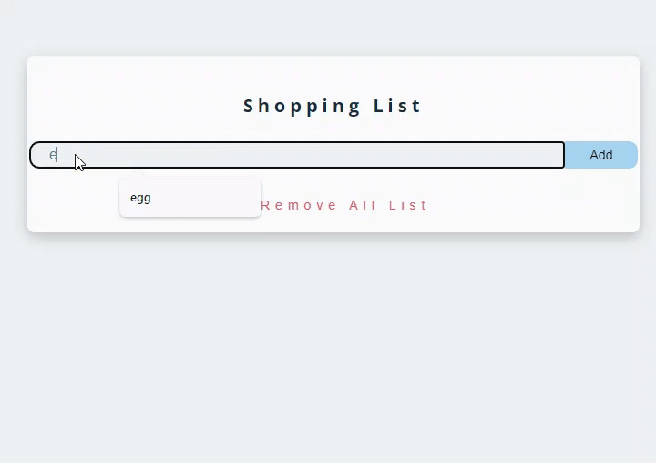

# Crud-App
<h1>Shopping List</h1>

<h2> Desc </h2>

This project is a web application that allows users to create lists, add and remove items from lists. It also includes a feature that allows the user to delete the entire list with a single button. The app is fully responsive, meaning it runs smoothly on different devices.

<ul>Features

<li>Users can create, edit and delete lists.</li>

<li>Can add and remove list items.</li>

<li>Ability to delete the entire list with a single button.</li>

<li>Alert messages that provide instant feedback for items added or removed.</li>

</ul>

<ul>Technologies

<li>HTML</li>

<li>CSS</li>

<li>Javascrit</li>

</ul>

<h2>How to use</h2>

1. Open the project's URL in your web browser.

2. On the home page, create a new list by clicking the "Create New List" button.

3. Add list items by clicking the "Add" button on the created list.

4. To remove an item from the list, click the eject (trash) button next to the item.
Click the "Clear List" button to clear the entire list.

# Shopping-List
